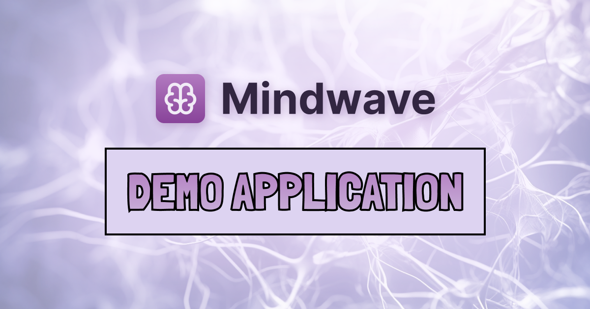

# Mindwave Demo Application

This is a demo application showcasing the real-world usage for
the [Mindwave Package](https://github.com/helgesverre/mindwave) for Laravel.

This demo application allows users to upload or index their own files, and then interact with an AI chatbot about the
contents of those files.

**Note:** this is a demo application and although it is continuously being updated with new features, it is primarily
meant to be an example and not a production ready application.

Feel free to fork and add features, contributions are welcome.

## What is Mindwave?

Mindwave is a Laravel package that lets you easily build AI-powered chatbots, agents, and document question and
answering (Q&A) functionality into your application.

[Learn more here](https://mindwave.no)

## Getting Started

To get started with the Mindwave Demo Application, follow these steps:

```shell
git clone git@github.com:HelgeSverre/mindwave-demo.git
cd mindwave-demo
composer install
cp .env.example .env
sail up -d
sail artisan key:generate
sail artisan migrate:fresh --seed
yarn install
yarn dev
```

**Note:** Make sure to update your `.env` file with the correct database credentials and
your [OpenAI API Key](https://platform.openai.com/account/api-keys).
